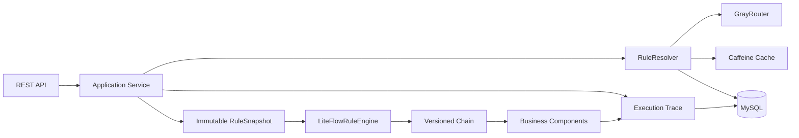

# FlowPilot

FlowPilot 是一个基于 Java 21、Spring Boot、LiteFlow 和 MySQL 的动态规则编排与灰度发布平台。
它解决的不是“如何写一个规则表达式”，而是规则进入生产环境后如何安全地创建版本、校验、发布、
灰度、回滚、平滑切换和追踪执行现场。

## 核心能力

- 动态编排：支持 LiteFlow 串行、并行等 EL 规则，规则内容存储在数据库中。
- 不可变执行快照：一次请求只解析一次 `RuleSnapshot`，执行过程中不会重新读取当前版本。
- 版本化 Chain：Chain ID 使用 `ruleCode + version`，新版本发布不会覆盖在途请求使用的旧 Chain。
- 安全发布：规则预校验与预加载在事务前完成，状态迁移通过行锁、预期状态和 CAS 更新保护。
- 稳定灰度：根据 `routingKey` 做确定性哈希，同一个用户持续命中同一版本。
- 完整生命周期：支持首次发布、升级发布、回滚、开启灰度、调整比例、停止灰度和灰度转正。
- 执行追踪：记录执行版本、状态、耗时、错误，以及每个节点的状态、耗时和异常。
- 并发保障：自动化测试覆盖并发发布和平滑切换，在途 V1 与新请求 V2 不会串版本。
- 操作可审计：发布和灰度变更记录操作者、操作类型、状态、请求摘要与完成时间。
- 写操作幂等：支持 `X-Operation-Id`，重复提交同一操作不会重复触发状态迁移。
- 变更 Outbox：版本和灰度迁移在同一事务写入可重试事件，处理器通过数据库抢占避免多实例重复消费。
- 安全执行模式：支持 `LIVE`、`DRY_RUN` 和 `SHADOW`，可在不产生真实副作用的情况下预演或比较候选版本。

## 架构



一次执行的关键路径：

```text
executionId → resolve once → fixed RuleSnapshot → versioned Chain → components → trace
```

## 技术栈

- Java 21
- Spring Boot 3.5
- LiteFlow 2.16
- Spring JDBC
- MySQL 8 / H2（测试）
- Caffeine
- Flyway（生产 schema 迁移）
- JUnit 5、AssertJ、MockMvc、Testcontainers（真实 MySQL 验证）
- springdoc OpenAPI

## 快速启动

前置要求：JDK 21、Docker（或本地 MySQL）。

### 1. 启动 MySQL

```bash
docker compose up -d
```

应用启动时由 Flyway 执行 `src/main/resources/db/migration/V1__init_schema.sql` 创建或升级表结构。
`src/main/resources/db/schema.sql` 仅用于 H2 测试初始化。

### 2. 配置数据库并启动应用

PowerShell：

```powershell
$env:FLOWPILOT_DB_URL="jdbc:mysql://localhost:3306/flowpilot?useUnicode=true&characterEncoding=utf8&serverTimezone=Asia/Shanghai"
$env:FLOWPILOT_DB_USERNAME="root"
$env:FLOWPILOT_DB_PASSWORD="flowpilot"
.\mvnw.cmd spring-boot:run
```

应用默认监听 `http://localhost:8080`。

### 3. 跑通真实链路

创建规则：

```bash
curl -X POST http://localhost:8080/api/rules \
  -H "Content-Type: application/json" \
  -d '{"ruleCode":"ORDER_FLOW","ruleName":"订单流程","description":"订单风控与创建"}'
```

创建 V1：

```bash
curl -X POST http://localhost:8080/api/rules/ORDER_FLOW/versions \
  -H "Content-Type: application/json" \
  -d '{"ruleContent":"THEN(userCheck,stockCheck,createOrder)","createdBy":"demo"}'
```

发布 V1：

```bash
curl -X POST http://localhost:8080/api/rules/ORDER_FLOW/versions/1/publish
```

执行规则：

```bash
curl -X POST http://localhost:8080/api/flows/ORDER_FLOW/execute \
  -H "Content-Type: application/json" \
  -d '{"routingKey":"customer-10001","variables":{"userValid":true,"stockAvailable":true}}'
```

响应中的 `executionId` 可用于查询完整链路：

```bash
curl http://localhost:8080/api/executions/{executionId}
```

## API 一览

| 方法 | 路径 | 作用 |
|---|---|---|
| `POST` | `/api/rules` | 创建规则 |
| `GET` | `/api/rules/{ruleCode}` | 查询规则 |
| `POST` | `/api/rules/{ruleCode}/versions` | 创建草稿版本 |
| `GET` | `/api/rules/{ruleCode}/versions` | 查询版本历史 |
| `POST` | `/api/rules/{ruleCode}/versions/{version}/publish` | 发布版本 |
| `POST` | `/api/rules/{ruleCode}/rollback` | 回滚版本 |
| `POST` | `/api/rules/{ruleCode}/gray` | 开启灰度 |
| `PUT` | `/api/rules/{ruleCode}/gray` | 调整灰度比例 |
| `DELETE` | `/api/rules/{ruleCode}/gray` | 停止灰度 |
| `POST` | `/api/rules/{ruleCode}/gray/promote` | 灰度转正 |
| `GET` | `/api/rules/{ruleCode}/gray` | 查询活动灰度策略 |
| `POST` | `/api/flows/{ruleCode}/execute` | 执行规则 |
| `GET` | `/api/executions/{executionId}` | 查询执行与节点明细 |

活动灰度比例只接受 `1~99`。`0` 使用停止灰度接口，`100` 使用灰度转正接口，避免状态语义含糊。

发布、回滚和灰度变更支持以下请求头：`X-Operation-Id`（幂等键，可选）、`X-Operator`（操作者）和
`X-Roles`（逗号分隔角色）。默认关闭角色校验以兼容本地调用；生产环境设置
`FLOWPILOT_SECURITY_REQUIRE_ROLE=true` 后，需要 `RELEASE_MANAGER` 或 `RULE_ADMIN` 角色。

## 测试

```powershell
.\mvnw.cmd clean test
```

当前测试覆盖：领域约束、缓存、稳定哈希路由、LiteFlow 串行/并行执行、发布与回滚、灰度生命周期、
并发发布、HTTP 完整链路、在途请求平滑切换、成功与失败执行追踪。

工程化验证还包括：OpenAPI 文档可访问性、Flyway 迁移脚本，以及基于 Testcontainers 的 MySQL
迁移验证。没有安装 Docker 时，MySQL 容器测试会自动跳过；在 CI（`.github/workflows/ci.yml`）中会
使用带 Docker 的运行环境执行完整校验。启动应用后可访问 `/swagger-ui.html` 或 `/v3/api-docs`。

Phase 9 额外验证操作 ID 重放、请求摘要冲突、失败审计和角色边界。审计数据保存在
`flow_operation_audit`，可按规则和状态建立运维查询。

Phase 10 的 `rule_change_outbox` 保存规则发布、回滚和灰度变更事件，状态机提交回滚时事件也会回滚。
`RuleChangeOutboxDispatcher` 以 `PENDING → PROCESSING → PROCESSED` 状态推进，处理失败会增加重试次数
并延迟再次可见；当前内置处理器负责本地缓存失效，跨实例广播可在该处理器后接入消息系统。

Phase 11 提供 Micrometer 指标（执行总量、耗时、灰度保护动作）、`X-Trace-Id` 请求链路标识和结构化
关键日志。灰度版本执行失败达到 `FLOWPILOT_GRAY_FAILURE_THRESHOLD`（默认 5）时，系统会自动停止该灰度
策略并记录保护指标；Actuator 健康检查、指标和 Prometheus 端点按配置暴露。

执行接口请求体可以增加 `mode` 和 `shadowVersion`：

```json
{
  "routingKey": "customer-10001",
  "variables": {"userValid": true},
  "mode": "SHADOW",
  "shadowVersion": 2
}
```

`DRY_RUN` 会把写入类节点转换成预演字段（例如 `orderWouldBeCreated`），`SHADOW` 会返回主版本和候选
版本的 executionId、结果及 `matched` 对比值。执行追踪默认保留 30 天，可通过
`FLOWPILOT_EXECUTION_RETENTION_DAYS` 和 `FLOWPILOT_EXECUTION_RETENTION_BATCH_SIZE` 调整清理策略。
单实例执行并发由 `FLOWPILOT_EXECUTION_MAX_CONCURRENCY`（默认 256）和
`FLOWPILOT_EXECUTION_ADMISSION_TIMEOUT_MS` 控制，超出容量的请求会快速返回冲突，避免无限堆积。

## 关键设计取舍

1. 发布切换的是数据库中的稳定版本指针，不修改已生成的执行快照。
2. 每个规则版本对应独立 LiteFlow Chain，避免热更新覆盖旧 Chain。
3. 发布、回滚和灰度迁移先锁定规则定义行，再执行状态 CAS，所有受影响行数必须为 1。
4. 规则语法、组件存在性和 Chain 加载在事务前验证，缩短数据库锁持有时间。
5. 第一版按单实例设计，本地缓存由生命周期服务精确失效；多实例缓存广播不在当前范围内。

## 项目边界

当前版本已经形成可运行、可测试的后端闭环，但仍是第一版工程实现：未包含认证授权、管理后台、
多实例缓存一致性、限流、指标监控和生产级容灾。这些能力应按真实部署场景继续演进，而不是在 Demo 中
虚构“生产可用”。

更完整的设计说明见：

- [技术升级报告](./FlowPilot%20动态规则编排与灰度发布平台技术升级报告.md)
- [数据库、包结构与核心接口定义](./FlowPilot%20数据库表、包结构与核心接口定义.md)
